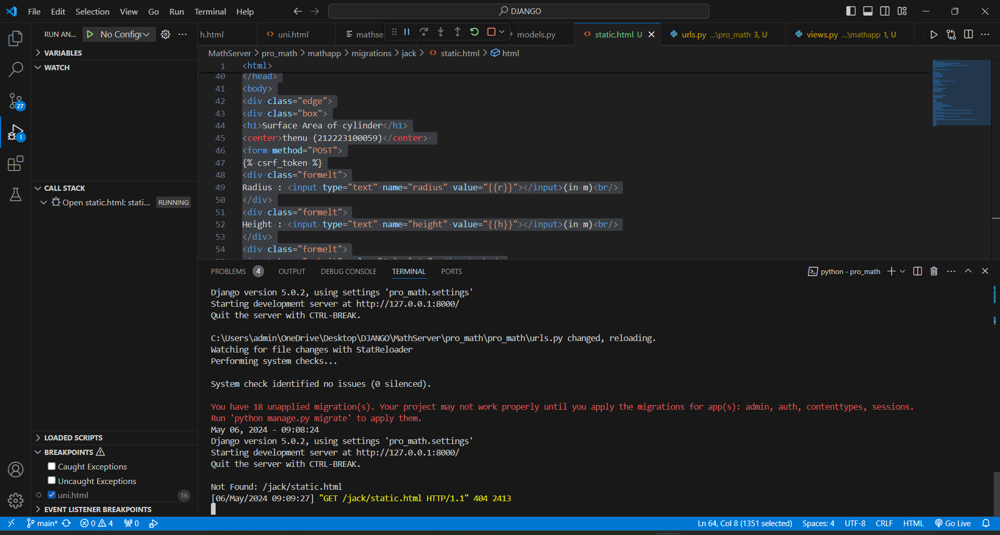
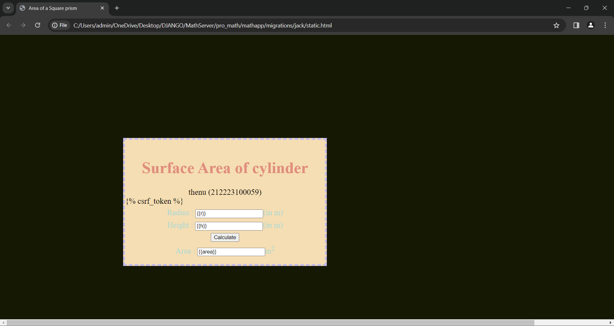

# Ex.05 Design a Website for Server Side Processing
## Date: 6.5.24

## AIM:
To design a website to find surface area of a Right Cylinder in server side.

## FORMULA:
Surface Area = 2Πrh + 2Πr<sup>2</sup>
<br>r --> Radius of Right Cylinder
<br>h --> Height of Right Cylinder

## DESIGN STEPS:

### Step 1:
Clone the repository from GitHub.

### Step 2:
Create Django Admin project.

### Step 3:
Create a New App under the Django Admin project.

### Step 4:
Create python programs for views and urls to perform server side processing.

### Step 5:
Create a HTML file to implement form based input and output.

### Step 6:
Publish the website in the given URL.

## PROGRAM :
```
static.html

<html>
<head>
<meta charset='utf-8'>
<meta http-equiv='X-UA-Compatible' content='IE=edge'>
<title>Area of a Square prism</title>
<meta name='viewport' content='width=device-width, initial-scale=1'>
<style type="text/css">
body 
{
background-color:rgb(21, 24, 3);
}
.edge {
width: 1440px;
margin-left: auto;
margin-right: auto;
padding-top: 250px;
padding-left: 300px;
}
.box {
display:block;
border: Thick dashed rgb(197, 188, 233);
width: 500px;
min-height: 300px;
font-size: 20px;
background-color:wheat;
}
.formelt{
color:rgb(170, 216, 212);
text-align: center;
margin-top: 7px;
margin-bottom: 6px;
}
h1
{
color:rgb(224, 141, 125);
text-align: center;
padding-top: 20px;
}
</style>
</head>
<body>
<div class="edge">
<div class="box">
<h1>Surface Area of cylinder</h1>
<center>thenu (212223100059)</center> 
<form method="POST">

<div class="formelt">
Radius : <input type="text" name="radius" value="{{r}}"></input>(in m)<br/>
</div>
<div class="formelt">
Height : <input type="text" name="height" value="{{h}}"></input>(in m)<br/>
</div>
<div class="formelt">
<input type="submit" value="Calculate"></input><br/>
</div>
<div class="formelt">
Area : <input type="text" name="area" value="{{area}}"></input>m<sup>2</sup><br/>
</div>
</form>
</div>
</div>
</body>
</html>
```
```
urls.py

from django.contrib import admin
from django.urls import path
from mathapp import views
urlpatterns = [
    path('admin/', admin.site.urls),
    path('surfaceareaofcylinder/',views.surfacearea,name="surfaceareaofcylinder"),
    path('',views.surfacearea,name="surfaceareaofcylinderroot")
]
```
```
views.py

from django.shortcuts import render
def surfacearea(request):
    context={}
    context['area'] = "0"
    context['r'] = "0"
    context['h'] = "0"
    if request.method == 'POST':
        print("POST method is used")
        r = request.POST.get('radius','0')
        h = request.POST.get('height','0')
        print('request=',request)
        print('radius=',r)
        print('height=',h)
        area = 2 * 3.14 * int(r) * int(h) + 2 * 3.14 * int(r) * int(r)
        context['area'] = area
        context['r'] = r
        context['h'] = h
        print('Area=',area)
    return render(request,'mathapp/math.html',context)
```

## SERVER SIDE PROCESSING:


## HOMEPAGE:


## RESULT:
The program for performing server side processing is completed successfully.
